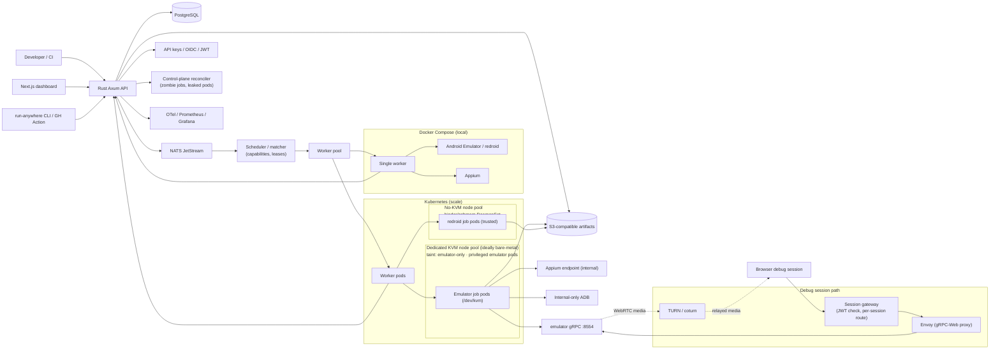

# Android QA Emulator Grid — Enhanced Architecture (Codename: Open Source)

Date: 2026-06-27
Status: implementation-ready architecture (supersedes `ANDROID_QA_EMULATOR_GRID_TECH_ARCHITECTURE.md`)
Working project name (placeholder, **TODO: finalize early**): `run-anywhere`
Companion: `00_REVIEW_AND_ENHANCEMENTS.md` (what changed and why) · `PART_MAP_AND_SEQUENCING.md` (build breakdown)

> This document keeps the original strategy intact and adds the engineering detail required to actually ship it: the runtime isolation/deployability matrix (§6b), the KVM/nested-virt substrate reality (§6c, §10), the real WebRTC signaling stack (§11b), scheduler/queue reliability (§8b), and the data, auth, secrets, warm-pool, arch-matrix, and observability layers (§7b–§7c, §15b–§15e).

---

## 1. Executive summary

The product is a **self-hosted Android emulator grid for CI, QA, and browser-based debugging.** QA teams already need repeatable, parallel Android test runs with Appium automation, logs, screenshots, videos, crash traces, and the ability to open a failed test in a browser. That is a real, narrow, fundable pain.

Two non-negotiable truths shape everything:

- **One emulator = one Android device/session/job.** An emulator does not multiplex hundreds of users or tests.
- A **Rust control plane** orchestrates hundreds of isolated emulator jobs across many machines.

v1 supports two modes:

- **Headless CI mode:** upload APK → install/launch/Appium → collect artifacts → pass/fail.
- **Browser debug mode:** a secure WebRTC session into a running emulator, opened on failure or on demand (the *exception* path, not every run).

Two corrections that the rest of the document operationalizes:

1. **Runtime choice is an isolation-vs-deployability tradeoff, not a maturity ladder** (§6b). The KVM-backed Android Emulator gives a VM isolation boundary and is the default for untrusted/QA workloads; redroid needs no KVM and deploys cheaply anywhere (great for trusted/internal/ARM/CI) but shares the host kernel and runs privileged. Both are first-class; pick per workload trust level.
2. **KVM access is the hardest infrastructure constraint** (§6c). Managed-Kubernetes standard nodes usually do not expose `/dev/kvm`; enabling nested virtualization constrains machine types, breaks node auto-provisioning, and **requires privileged pods** — which must be reconciled with the security model via dedicated, single-purpose, ephemeral node pools.

Deployment substrate:

- **Docker Compose** for local dev, demos, single-host labs.
- **Kubernetes** for scalable worker fleets on KVM-capable (preferably bare-metal) nodes, plus a no-KVM redroid lane.

---

## 2. Product verdict

A solid open-source product **if positioned narrowly**:

> Open-source Android emulator grid for CI, QA automation, and browser debugging.

Do **not** position v1 as: a consumer Android cloud-gaming platform; a replacement for all managed device farms; a "monetize any APK" marketplace; or a custom Android emulator. The open-source wedge is developer utility. The hosted commercial product later sells managed KVM/GPU runners, team dashboards, retention, enterprise auth, and scaling.

---

## 3. What not to build first

Do not build: a new Android emulator; an Android OS fork; a custom video codec; a custom WebRTC implementation; a public multi-tenant marketplace as OSS v1; a "convert any APK to web" tool; or a consumer cloud-gaming wedge. These are expensive distractions. The correct first wedge is a developer/QA utility that runs Android jobs, collects artifacts, and opens browser debug sessions.

---

## 4. Recommended technology stack

| Layer | Recommendation | Why |
|---|---|---|
| Control plane | Rust + Axum + Tokio | Fast, safe, async, clean API/control-plane fit |
| Database | PostgreSQL + SQLx (+ `sqlx migrate`) | Durable jobs, results, users, devices, projects, artifacts |
| Queue/eventing | NATS JetStream (Redis acceptable for local/dev) | Durable dispatch with ack deadlines, worker events, backpressure |
| Artifact storage | S3-compatible (MinIO locally) | Screenshots, video, logcat, crash dumps, reports |
| Frontend | Next.js App Router + TypeScript | Dashboard, job detail, debug viewer, admin UI |
| Local runtime | Docker Compose (+ profiles) | One-machine demos and development |
| Scale runtime | Kubernetes | Worker pools, node affinity, taints/tolerations, autoscaling |
| Android runtime (default, untrusted) | Android Emulator in Docker/KVM | Official QA runtime; VM isolation boundary; gRPC+WebRTC bridge |
| Android runtime (trusted/no-KVM/ARM) | **redroid** (first-class) | No KVM; cheap; ARM-native; shared-kernel + privileged (isolation caveat) |
| Android runtime (high-fidelity, later) | AOSP Cuttlefish | Official AVD; first-class WebRTC; closest to real device |
| Runtime (research only) | browser-native WASM (v86/WebVM family) | Demos/education; not for revenue QA |
| Automation | Appium 2.x + internal ADB | Standard QA ecosystem (drivers installed separately in v2) |
| Browser stream protocol | emulator **gRPC** (`-grpc` flag) → **WebRTC** | Native, low-latency live inspection and input |
| Browser↔gRPC bridge | **Envoy (gRPC-Web proxy)** | Browsers can't speak raw gRPC; Envoy provides unary + server streaming |
| Debug auth | **JWT token service** (short-lived signed tokens) | Per-session auth at the edge |
| NAT traversal | **TURN (coturn)** — required behind cluster NAT | WebRTC media relay when peer-to-peer is blocked |
| Browser package | TS package with provider adapters | Shared viewport/input layer across remote and experimental modes |
| Secrets | K8s Secrets (OSS) / Vault or cloud secret manager + External Secrets Operator (prod) | DB, S3, registry, JWT signing, TURN secrets |
| Observability | OpenTelemetry traces + Prometheus + Grafana; structured JSON logs | Threaded from MVP, not bolted on later |

Sources for runtime/stream claims:

- Android Emulator command-line/headless incl. `-no-window` ([emulator CLI](https://developer.android.com/studio/run/emulator-commandline)).
- Emulator container scripts: gRPC endpoint (`-grpc <port>`) + WebRTC bridge; reference stack uses Envoy, Nginx, a JWT token service; gRPC-Web limited to unary + server streaming; TURN needed behind a firewall ([android-emulator-container-scripts](https://github.com/google/android-emulator-container-scripts), [/js README](https://github.com/google/android-emulator-container-scripts/tree/master/js)).
- `android-emulator-webrtc` React lib is **archived** — reference only, do not depend on it ([repo](https://github.com/google/android-emulator-webrtc)).
- Cuttlefish documents browser WebRTC remote control ([Cuttlefish WebRTC](https://source.android.com/docs/devices/cuttlefish/webrtc)).
- redroid runs Android userspace on the host kernel via binder/ashmem, no `/dev/kvm`, `--privileged`, ARM-native; warns host can be compromised if ADB is exposed ([redroid-doc](https://github.com/remote-android/redroid-doc), [no-KVM writeup](https://codersera.com/blog/android-emulator-docker-without-kvm/)).
- Appium standard automation server ([Appium docs](https://appium.io/docs/en/latest/)).

---

## 5. Architecture diagram



---

## 6. Core concepts

### Job
One requested QA/test run: APK install, optional test APK, optional Appium script, optional built-in smoke test (launch main activity, wait, screenshot, logcat), optional live debug.

### Emulator session
One Android runtime instance: one Android version/device profile, one APK/test context, one Appium endpoint, one internal ADB endpoint, one optional WebRTC debug bridge.

### Worker
A host or pod that runs emulator sessions. Workers claim queued jobs, start runtimes via adapter, install APKs, run tests, stream logs/events, upload artifacts, and clean up. Workers are stateless except for the job currently executing.

### Runtime adapter
Hides runtime specifics behind a common trait: `android_emulator_container`, `redroid`, `cuttlefish`, future `physical_device_lab`, experimental `browser_native_wasm`.

### Runtime trust tier (new)
Each runtime is tagged with the isolation boundary it provides — `vm_isolated` (Android Emulator/Cuttlefish via KVM) or `shared_kernel_privileged` (redroid). Jobs carry a required minimum tier; **untrusted/multi-tenant jobs require `vm_isolated`.**

### Warm pool (new)
A small set of pre-booted runtimes per popular `runtime_profile`, handed to incoming jobs to cut cold-boot latency, then recycled (trusted) or destroyed (untrusted, default).

### Session gateway (new)
The edge component that validates a debug JWT and routes a browser to the correct emulator pod's gRPC-Web/Envoy endpoint; no unauthenticated path reaches a runtime.

---

## 6b. Runtime selection & isolation-vs-deployability matrix (NEW — fixes F1)

The earlier "Android Emulator → Cuttlefish → redroid (experimental)" ordering is replaced by an explicit tradeoff. The axis that matters is **isolation boundary vs. deployment cost/portability**.

| Runtime | Isolation boundary | Needs `/dev/kvm`? | Host requirement | Arch | Boot/cost | Best for |
|---|---|---|---|---|---|---|
| **Android Emulator (container)** | VM (KVM) — strong | **Yes** | KVM-capable node, privileged device | x86 fast (ARM via translation, slower) | Slow cold boot, RAM-heavy (~2–4 GB) | **Default for untrusted/QA wedge**; official tooling; gRPC+WebRTC |
| **redroid** | Shared host kernel + `--privileged` — weak | **No** | binder/ashmem kernel modules on host | ARM-native or x86; ARM is cheapest | Fast boot, lighter | **Trusted/internal CI, no-KVM, ARM fleets**; first-class, not experimental |
| **Cuttlefish** | VM (KVM) — strong | **Yes** | KVM-capable node | x86/ARM | Heavier than emulator | High-fidelity device matrix later; first-class WebRTC |
| **browser-native WASM** | Browser sandbox | No | — | — | — | Research/demos only; never revenue QA |

Decision rule:

1. **Untrusted APK or multi-tenant** → require `vm_isolated` → Android Emulator (default) or Cuttlefish. Accept the KVM cost (§6c).
2. **Trusted/first-party APK, internal CI, or cost/ARM-sensitive** → redroid is allowed and often preferred (no KVM, cheap, ARM-native), **provided** it runs on dedicated nodes with the isolation caveats of §15.
3. **Fidelity-critical** (sensors, near-real-device behavior) → Cuttlefish.
4. Never put untrusted multi-tenant load on redroid by default — shared kernel + privileged means a container escape is a host compromise; redroid's own docs warn about this ([redroid-doc](https://github.com/remote-android/redroid-doc)).

This repairs the internal inconsistency: redroid is the answer to the KVM-availability problem *for trusted workloads*, while the Android Emulator remains the safe default for untrusted ones.

---

## 6c. Host substrate & KVM / nested-virtualization reality (NEW — fixes F2)

This is the single biggest feasibility constraint and must drive the K8s design.

**The core problem:** managed-Kubernetes standard node pools generally do not expose `/dev/kvm`, and the SDK Android Emulator/Cuttlefish need it for acceptable performance. Software mode (`-no-accel -gpu swiftshader_indirect`) works but is far slower.

Per-cloud reality (verify at build time — these constraints move):

- **GKE:** nested virtualization is **Standard-clusters-only (not Autopilot)**, restricted to a **limited machine-series set**, **incompatible with node auto-provisioning**, and **requires `securityContext.privileged: true`** for pods to interact with nested VMs ([GKE nested virtualization](https://cloud.google.com/kubernetes-engine/docs/how-to/nested-virtualization)).
- **AKS:** needs Gen2 VM sizes that support nested virt (e.g. Dsv3); **Kata-based Pod Sandboxing** (`KataVmIsolation`) is available as an isolation tool for untrusted workloads ([AKS Pod Sandboxing](https://learn.microsoft.com/en-us/azure/aks/use-pod-sandboxing)).
- **EKS:** practically requires bare-metal (`*.metal`) or specific instance types to get `/dev/kvm`.

**Consequences for the architecture:**

1. **Dedicated KVM node pool, single-purpose.** Emulator job pods run privileged on `/dev/kvm`; isolate the blast radius by giving them **their own taint** so nothing else schedules there, and treat those nodes as **ephemeral** (recycle aggressively).
2. **Prefer bare-metal for the KVM pool.** Avoids the nested-virt performance tax (cloud VM → nested KVM → emulator), which GKE explicitly flags as workload-dependent overhead. Bare-metal is frequently cheaper per emulator at scale.
3. **Autoscaling must not rely on generic node auto-provisioning** (incompatible on GKE for nested-virt pools). Use **pre-provisioned KVM pools + cluster-autoscaler**, or **Karpenter pinned to specific instance types**. Scale-to-zero is possible but cold node bring-up is minutes.
4. **The privileged requirement conflicts with "strict isolation."** Resolve it explicitly (§15): privileged is acceptable **only** on dedicated, single-tenant-per-job, ephemeral, network-policied nodes; the *control plane* (API/scheduler/web) never runs privileged and may use gVisor/Kata.
5. **redroid lane is the no-KVM escape hatch:** a separate node pool with binder/ashmem modules loaded (privileged DaemonSet or pre-baked node image), used for trusted jobs and ARM cost optimization — no nested virt required.

---

## 7. Public API design

Minimum v1 API (all under `/v1`, all authenticated):

| Method | Path | Purpose |
|---|---|---|
| `POST` | `/v1/projects` | Create project/app namespace |
| `POST` | `/v1/uploads/apk` | Create signed APK upload URL |
| `POST` | `/v1/jobs` | Create emulator/test job (accepts `Idempotency-Key`) |
| `GET` | `/v1/jobs/{job_id}` | Read job status and summary |
| `GET` | `/v1/jobs?project_id=&status=&cursor=` | List jobs (paginated) |
| `GET` | `/v1/jobs/{job_id}/events` | Stream lifecycle events (SSE) |
| `GET` | `/v1/jobs/{job_id}/artifacts` | List screenshots, video, logs, reports |
| `POST` | `/v1/jobs/{job_id}/debug-sessions` | Create short-lived browser debug token |
| `POST` | `/v1/jobs/{job_id}/cancel` | Cancel queued/running job |
| `POST` | `/v1/webhooks` | Register callback URL (job state changes) |
| `GET` | `/v1/workers` | Admin worker status |
| `GET` | `/v1/runtime-profiles` | List Android versions/device profiles |

Job creation request:

```json
{
  "project_id": "proj_123",
  "apk_upload_id": "apk_123",
  "test_upload_id": "apk_test_123",
  "runtime_profile": "android-35-pixel-6-x86_64",
  "mode": "headless_ci",
  "min_isolation": "vm_isolated",
  "automation": { "type": "appium", "script_ref": "s3://bucket/tests/login-flow.zip" },
  "artifacts": { "screenshots": true, "video": true, "logcat": true, "junit": true },
  "timeout_seconds": 900
}
```

Idempotency: `POST /v1/jobs` honors an `Idempotency-Key` header so CI retries don't double-enqueue. Webhooks let CI avoid long-polling the events stream.

Job states: `queued`, `claimed`, `provisioning_runtime`, `booting`, `installing_apk`, `running_tests`, `debug_available`, `collecting_artifacts`, `cleaning_up`, `passed`, `failed`, `cancelled`, `timed_out`, `infra_failed`.

---

## 7b. Data model (NEW — fixes F5)

Metadata in Postgres; binary artifacts in object storage. Schema sketch (column lists abbreviated):

- `projects` (id, name, created_at, owner)
- `api_keys` (id, project_id, hash, scopes[], created_at, last_used_at, revoked_at)
- `uploads` (id, project_id, kind[apk|test|script], s3_key, sha256, size, created_at)
- `runtime_profiles` (id, android_api, device_profile, abi, host_arch, runtime_kind, image_ref, isolation_tier)
- `jobs` (id, project_id, runtime_profile_id, mode, min_isolation, state, idempotency_key, worker_id, timeout_seconds, created_at, started_at, finished_at, result)
- `job_events` (id, job_id, ts, type, payload jsonb) — append-only; powers the SSE stream
- `artifacts` (id, job_id, kind, s3_key, size, sha256, created_at)
- `workers` (id, runtimes[], kvm, gpu, arch, capacity, last_heartbeat_at, state)
- `debug_sessions` (id, job_id, token_jti, created_by, created_at, expires_at, ended_at, mode[viewer|controller])
- `audit_log` (id, actor, action, subject, ts, payload jsonb)

Migrations via `sqlx migrate` (or `refinery`). Seed `runtime_profiles` for the common Android API/device/ABI combinations.

---

## 7c. AuthN / AuthZ (NEW — fixes F6)

- **OSS core:** hashed, project-scoped **API keys** (sent as a bearer token); optional **OIDC** login for the dashboard.
- **Scopes/roles:** `project:read`, `project:write`, `debug:create`, `admin` (workers, runtime-profiles). Keys carry scopes; the dashboard maps OIDC identities to roles.
- **Debug tokens:** short-lived **JWTs**, audience-bound to a single job/session, carrying `jti` (for single-use/audit) and `mode` (viewer|controller); **validated at the session gateway** before any runtime is reachable.
- **Commercial:** SSO/SAML, org/team model, fine-grained RBAC, audit export.

---

## 8. Worker protocol

Worker loop:

1. Register with API: worker ID, runtime capabilities, KVM/GPU availability, arch, capacity.
2. **Claim** a job from JetStream (with an ack deadline / lease).
3. Pull APK/test artifacts from object storage (pre-signed URLs).
4. Start runtime via adapter; **heartbeat-extend the lease** throughout.
5. Wait for boot + health check.
6. Install APK/test APK (idempotent).
7. Start Appium server if requested.
8. Run tests / smoke flow.
9. Optionally expose a WebRTC debug session.
10. **Upload artifacts (must complete before cleanup — hard finalizer gate).**
11. Wipe runtime/session state; on `vm_isolated` untrusted jobs, destroy the pod/node-slot.
12. Mark job complete (idempotent state transition).

Worker heartbeat:

```json
{
  "worker_id": "worker_01",
  "active_jobs": 3,
  "capacity": 8,
  "runtimes": ["android_emulator_container", "redroid"],
  "kvm": true, "gpu": false, "arch": "x86_64",
  "lease_extends": ["job_abc", "job_def"],
  "last_seen": "2026-06-27T12:00:00Z"
}
```

---

## 8b. Scheduler, queue semantics & failure handling (NEW — fixes F4)

**Dispatch & leasing.** Jobs are published to a JetStream stream with a **pull consumer + ack deadline (visibility timeout)**. A worker that claims a job must **extend the ack deadline via heartbeat** while it runs; if the worker dies, the message is redelivered and another eligible worker claims it. Configure `max_deliver`; route exhausted messages to a **DLQ subject** for inspection (poison jobs).

**Capability matching.** The scheduler matches `job.runtime_profile` (which encodes `runtime_kind`, `abi`, `host_arch`, `isolation_tier`) against worker capabilities `{runtimes, kvm, gpu, arch, capacity}` and applies **backpressure** when pools are full. `min_isolation: vm_isolated` excludes redroid workers.

**Reconciler (control plane).** A periodic loop detects:
- jobs in `claimed`/`running` whose worker heartbeat/lease expired → mark `infra_failed` or requeue;
- leaked runtime pods/containers with no owning job → reap;
- `debug_sessions` past `expires_at` → revoke + audit.

**Idempotency.** Job creation uses `Idempotency-Key`; all worker side-effects (install, upload, state transition) are idempotent so redelivery cannot double-run.

**Quotas/fairness.** Per-project concurrency caps and simple priority lanes prevent one tenant from starving the grid.

**MVP simplification:** scheduler may be folded into the API process; the reconciler still runs (a single background task). Production splits the scheduler out.

---

## 9. Docker Compose support

Compose is for local dev, demos, single-host QA labs, and the OSS quickstart — **not** the production multi-tenant scaling story.

Services: `api` (Rust), `web` (Next.js), `postgres`, `nats`, `minio`, `worker` (Rust), `appium` (optional), `emulator` (Android Emulator container or `redroid` sidecar).

Profiles ([Compose profiles](https://docs.docker.com/compose/how-tos/profiles/)): `basic` (api/web/postgres/nats/minio), `emulator` (one KVM Android Emulator worker), `redroid` (no-KVM lane), `debug` (Envoy + TURN + token service), `appium`.

Constraints: Linux host with KVM for the emulator profile; the **redroid profile needs binder/ashmem modules loaded on the host**; Windows/macOS dev may need a remote Linux worker; GPU is host-specific and optional; only a few concurrent emulators per machine.

---

## 10. Kubernetes support (REWRITTEN — fixes F2)

Kubernetes provides parallel workers, multi-node fleets, dedicated KVM/GPU pools, and team/enterprise deployments.

Components: `api`, `web`, `scheduler` (Deployment, or folded into API for MVP), `worker` (Deployment per runtime type), `emulator-job` (Job or worker-created Pod), `postgres` (external managed or StatefulSet for dev), `nats` (StatefulSet or managed), `minio` (StatefulSet or external S3), plus the debug-path components (Envoy, TURN, token service, session gateway).

**Node scheduling (the crux):**

- Label and **taint** KVM-capable nodes (e.g. `run-anywhere.io/kvm=true:NoSchedule`) so **only emulator job pods** land there; use node affinity to pin them. General workloads are repelled ([taints/tolerations](https://kubernetes.io/docs/concepts/scheduling-eviction/taint-and-toleration/), [node assignment](https://kubernetes.io/docs/concepts/scheduling-eviction/assign-pod-node/)).
- Emulator pods need `/dev/kvm` and **`securityContext.privileged: true`** on most managed clouds (GKE requires it for nested VMs). **Prefer bare-metal nodes** to skip the nested-virt tax.
- A **separate no-KVM pool** runs redroid; load binder/ashmem via a privileged DaemonSet or a pre-baked node image. Tag it for trusted jobs only.
- **Autoscaling:** pre-provisioned KVM pools + cluster-autoscaler, or Karpenter pinned to specific instance types — **not** generic node auto-provisioning (incompatible with GKE nested-virt pools).

**Runtime pod requirements:** `/dev/kvm` where needed; strict `NetworkPolicy` (no public ADB, deny egress by default, block cloud metadata endpoints); per-runtime resource requests/limits; job timeout + forced cleanup; **artifact upload before deletion (finalizer)**.

**Scheduling model:** MVP — long-running worker pods create emulator containers locally; Production — a controller creates one pod/Job per emulator session for stronger isolation.

---

## 11. WebRTC debug design

WebRTC debug is **not** the default for every CI run. It is enabled on a failed job, a manual debug request, or an interactive dev session.

Session rules: short-lived signed token; one viewer/controller by default; no unauthenticated signaling; no public ADB; optional read-only viewer mode; auto-expire on timeout or job completion; full audit (who, when, which job).

The browser shows: live emulator screen; touch/mouse/keyboard input; logcat tail; test status; screenshot button; end-session button; runtime metrics (FPS, bitrate, RTT, CPU/RAM if available).

Cuttlefish's documented browser WebRTC remote control is a strong reference for this layer ([Cuttlefish WebRTC](https://source.android.com/docs/devices/cuttlefish/webrtc)).

---

## 11b. Debug session connectivity & signaling infra (NEW — fixes F3)

The emulator's native control/stream protocol is **gRPC**, activated by launching with `-grpc <port>` (default `:8554`). Browsers cannot speak raw gRPC, and the emulator behind cluster NAT cannot always reach the browser peer-to-peer. The production debug path therefore has four components:

1. **Session gateway** — validates the debug JWT (audience = this job/session, checks `jti`, `mode`), then routes to the correct emulator pod. No runtime is reachable without passing this.
2. **Envoy (gRPC-Web proxy)** — bridges browser gRPC-Web to the emulator's gRPC; gRPC-Web supports unary + server-side streaming, which is what the emulator control protocol needs.
3. **Emulator gRPC endpoint** (`:8554`, internal only) — never publicly exposed.
4. **TURN (coturn)** — relays WebRTC media when peer-to-peer is blocked. In Kubernetes the emulator is essentially always behind NAT, so **TURN is a required production component** (optional only for single-host/intranet). The reference container scripts note TURN is needed when the emulator server is behind a firewall.

Data flow:

```
Browser (@run-anywhere/browser-emulator, RemoteWebRtcProvider)
  → Session gateway  (JWT check, per-session route)
    → Envoy          (gRPC-Web ↔ gRPC)
      → Emulator gRPC :8554  (control + signaling)
WebRTC media: Emulator  ⇄  TURN/coturn  ⇄  Browser   (relayed when P2P blocked)
```

`android-emulator-webrtc` (the React lib) is archived; treat the **gRPC streaming protocol as the contract** and build a fresh, thin TypeScript client inside the browser package (§12).

---

## 12. Browser-based emulator package

Two distinct meanings, both supported without conflation:

1. **Browser as viewer/controller** — runtime runs server-side; browser receives WebRTC video/audio and sends input. **Production default.**
2. **Browser as runtime** — the browser runs a VM/emulator via JS/WASM. Possible for some x86/Linux workloads; **experimental for modern Android QA**, never the default.

Create a TS package `@run-anywhere/browser-emulator`, shared by QA debug sessions, future app-streaming player sessions, local demos, and browser-native experiments. It exposes one UI/input surface and multiple providers.

Provider model:

```ts
type EmulatorProviderKind =
  | "remote_webrtc"
  | "remote_screenshot_fallback"
  | "browser_native_wasm_experimental";

interface EmulatorProvider {
  kind: EmulatorProviderKind;
  connect(sessionToken: string): Promise<void>;
  disconnect(): Promise<void>;
  sendTouch(event: TouchInput): void;
  sendKey(event: KeyInput): void;
  sendText(text: string): void;
  captureScreenshot(): Promise<Blob>;
}
```

Providers: `RemoteWebRtcProvider` (production; Android Emulator container, Cuttlefish, etc., via the §11b path), `RemoteScreenshotFallbackProvider` (admin/testing only), `BrowserNativeWasmProvider` (experimental, v86/WebVM family). Shared components: `EmulatorViewport`, `InputBridge`, `TouchMapper`, `KeyboardMapper`, `GamepadMapper` (later), `ConnectionQualityIndicator`, `DebugToolbar`, `ScreenshotButton`, `LogcatPanel`, `ArtifactPanel`, `SessionTimer`. The input layer is shared across modes; only delivery differs (WebRTC data channel vs in-browser canvas).

**Feasibility verdict:** browser-native Android is an experiment, not the MVP path — modern Android emulation needs KVM/hardware acceleration the browser sandbox doesn't expose, and arbitrary APKs bring native ARM libs, Play Services assumptions, GPU needs, and anti-emulator checks. v86/WebVM prove browser-hosted VM concepts, not production Android APK QA. Keep one shared package; differ only in providers.

---

## 13. Appium and automation design

Appium support is required for adoption. Each job may request an internal Appium endpoint. Tests can be a zipped bundle, a Git reference, a container image, or the built-in smoke profile. Results include JUnit/XML or JSON where possible.

Note **Appium 2.x** changed the driver model — drivers (e.g. UiAutomator2) are installed separately from the server; the worker image must provision the needed drivers ([Appium docs](https://appium.io/docs/en/latest/)).

Built-in smoke tests: install APK; launch main activity; wait for idle/start screen; capture screenshot; collect logcat; detect process crash; optional short monkey test.

---

## 14. Artifact model

Artifacts: APK metadata, install logs, logcat, screenshots, video, Appium logs, JUnit/test reports, crash traces, runtime metrics, browser-debug session audit.

Storage: S3-compatible (MinIO local; S3/GCS/Azure Blob or MinIO in prod). Metadata in Postgres, blobs in object storage. **Robustness:** multipart upload for large video; retries with backoff; checksums; pre-signed URLs; and a **hard finalizer** — a job cannot transition to a terminal state until its artifacts are confirmed uploaded.

Retention: OSS default configurable local retention; hosted free tier short; paid tier longer + export.

---

## 15. Security model (EXPANDED — fixes the F2 tension)

Secure defaults are a product feature.

Baseline rules: never expose ADB publicly; never expose unauthenticated WebRTC/gRPC signaling; never reuse emulator data between jobs unless using a trusted snapshot pool; run untrusted APKs with egress restrictions; block cloud metadata endpoints; sign and quickly expire debug tokens; per-job audit logs; delete runtime pods/containers after completion; flag jobs that attempt network scans or privilege abuse.

**Reconciling privileged KVM pods with isolation (the F2 tension):**

- Privileged emulator pods run **only** on the **dedicated KVM node pool** that schedules nothing else (taint), is **single-job-per-pod**, and is **ephemeral** (nodes recycled frequently).
- The **control plane** (API/scheduler/web/reconciler) never runs privileged; it may run under **gVisor or Kata** for defense in depth.
- Apply **seccomp/AppArmor** profiles and drop capabilities on the emulator pod beyond what `/dev/kvm` requires.
- Enforce **NetworkPolicy**: deny-by-default egress, block metadata IPs, allow only the artifact store and required internal services.
- **redroid caveat:** redroid shares the host kernel and runs `--privileged` with host modules — a container escape is a host compromise. Restrict redroid to **trusted/first-party** jobs on its own pool; do not place untrusted multi-tenant load there; never expose its ADB ([redroid-doc](https://github.com/remote-android/redroid-doc)). For untrusted isolation on AKS, Kata Pod Sandboxing is an option ([AKS Pod Sandboxing](https://learn.microsoft.com/en-us/azure/aks/use-pod-sandboxing)).

Risk references: redroid warns host OS compromise is possible if ADB is exposed; DeviceFarmer/STF assumes trusted networks and reset semantics — both reinforce strong isolation before public use ([redroid](https://github.com/remote-android/redroid-doc), [STF](https://github.com/DeviceFarmer/stf)).

---

## 15b. Secrets management (NEW — fixes F7)

Secrets in play: DB creds, S3/registry creds, JWT signing keys, TURN shared secret, OIDC client secrets.

- **OSS:** env/file + Kubernetes Secrets; document rotation.
- **Production:** external store — Vault or a cloud secret manager via the **External Secrets Operator**; short-lived dynamic credentials where possible.
- **Workers** use **pre-signed URLs** for artifact upload rather than holding long-lived S3 credentials; the JWT signing key lives only in the token service.

---

## 15c. Boot time, snapshots & warm pools (NEW — fixes F8)

Smoke-test latency is dominated by emulator cold boot (30s–2min for the SDK emulator; redroid boots faster).

- **Snapshot / quick-boot** images for the SDK emulator to restore fast.
- **Warm pools:** keep N pre-booted runtimes per popular `runtime_profile`; hand one to an incoming job; then **recycle (trusted) or destroy (untrusted, default)**.
- This is both a latency and a cost lever. MVP may use cold boot; production should run warm pools sized to demand and quota.

---

## 15d. ARM vs x86 image/runtime matrix (NEW — fixes F9)

- **x86 host + KVM:** x86/x86_64 Android images run fast; ARM-only native libs need translation (libndk/houdini) — slower, some apps fail.
- **ARM host (Graviton/Ampere/Apple-silicon Linux):** ARM Android images run natively; **redroid is a strong, cheap fit** with no translation — often the cheapest no-KVM device farm.
- `runtime_profile` must encode `{android_api, device_profile, abi, host_arch}`; the **scheduler matches `host_arch`**. Ship a community **compatibility/benchmark matrix** (startup time, RAM/CPU, GPU mode, translation support) so users pick correctly.

---

## 15e. Observability & SLOs (NEW — fixes F10)

Thread observability from the MVP, not just production:

- **Structured JSON logs** with `job_id`/`worker_id` correlation everywhere.
- **OpenTelemetry traces** propagated API → queue → worker → runtime.
- **Prometheus metrics:** queue depth, claim latency, boot time, job duration, pass/fail rate, worker capacity/utilization, TURN bandwidth, debug-session count.
- **Grafana dashboards** + alerts (queue backlog, reconciler reaps, boot-time regressions).
- Candidate **SLOs:** job-accept latency, p95 cold-boot time per profile, job success rate excluding `infra_failed`, debug-session connect success.

---

## 16. MVP architecture

Goal: one developer uploads an APK, runs a headless smoke test, views artifacts, and opens a failed run in the browser.

Features: Rust Axum API; Next.js dashboard; Postgres; NATS JetStream (or Redis for dev); MinIO; one Linux/KVM worker; Android Emulator container adapter; APK upload; smoke-test job; logcat/screenshot artifacts; optional Appium endpoint; optional WebRTC debug link; `@run-anywhere/browser-emulator` with `RemoteWebRtcProvider`; **API-key auth, idempotent job creation, the reconciler, and basic OTel/Prometheus from day one.**

Non-goals: hosted marketplace; untrusted multi-tenant scale; GPU game streaming; Play Store publishing; revenue share; full device matrix; perfect iOS/Safari compatibility; browser-native Android runtime.

---

## 17. Production architecture

Adds: Kubernetes worker pools; KVM node labels/taints/tolerations/affinity; **dedicated, ideally bare-metal KVM nodes**; separate no-KVM redroid pool; optional GPU nodes; per-job pod isolation; snapshot/warm pools; worker autoscaling (pre-provisioned pools / Karpenter, not generic autoprovisioning); JetStream durable queues + DLQ; managed Postgres; external S3; team auth/RBAC; OTel/Prometheus/Grafana; rate limits/quotas; audit logs; the full debug signaling stack (session gateway + Envoy + TURN + token service); external secrets; billing for the hosted version.

---

## 18. Would developers love it?

Plausible interest: browser-based Android app demos; QA/testing automation; lightweight APK preview; self-hosted Android labs; indie devs wanting a web demo without managed pricing; companies wanting private internal app streaming.

Adoption is likelier if v1 nails one of: "run my APK in a browser locally with one command"; "spin up a disposable Android session in CI and stream it to the browser"; "create an embeddable web demo for my APK"; "self-host a small internal Android app lab"; "automate APK install/launch screenshots and smoke tests."

Adoption signals: Docker-Android (CI/testing, noVNC, Appium), DeviceFarmer/STF (browser remote control, APK install, logs, REST API), redroid (Android-in-cloud for automation/gaming), Cuttlefish (official WebRTC) — the category is real, but the first release must solve a narrow pain cleanly ([Docker-Android](https://github.com/budtmo/docker-android), [STF](https://github.com/DeviceFarmer/stf), [redroid](https://github.com/remote-android/redroid-doc), [Cuttlefish WebRTC](https://source.android.com/docs/devices/cuttlefish/webrtc)).

---

## 19. Open-source product strategy

**Open-core, not a fully open hosted marketplace.** Naming candidates: `run-anywhere-runtime`, `open-android-webstream`, `apk-web-runner`, `android-browser-runner` (**pick one early**).

OSS v1 includes: runtime adapter SDK; browser player shell; browser emulator package (remote WebRTC + experimental browser-native provider interface); local CLI; Docker Compose demo; APK smoke-test runner; example adapters (Android Emulator, redroid, Cuttlefish); docs for safe local/self-hosted use.

Paid/cloud keeps: hosted runtime fleet; malware scanning at scale; developer portal; subscriptions/credits/payments; revenue-share ledger (if marketplace returns); enterprise support; GPU/runtime autoscaling; compliance/audit/moderation.

Why open-core: builds trust, bottom-up adoption, easier integrations, avoids giving away hosted runtime economics, lets indies self-host while serious teams pay for reliability.

**Licensing/redistribution caveat (new):** Android Emulator system images and GMS/Play Services cannot be freely redistributed in a hosted product; redroid bundles third-party modules whose licenses must be examined. Keep image provisioning user-supplied where licensing requires, and document this.

---

## 20. Open-source and commercial split

OSS: Rust API/control-plane core; worker agent; runtime adapter SDK; Android Emulator + redroid adapters; local Compose quickstart; basic Next.js dashboard; basic artifact collection; Appium integration; WebRTC/debug adapter where legally/technically safe; `@run-anywhere/browser-emulator` (remote WebRTC + experimental browser-native interface).

Commercial: managed KVM/GPU runner fleet; team auth/SSO; advanced dashboards; long retention; enterprise audit; private networking; large device matrix; SLA/support; billing/quotas; advanced malware/risk scanning.

---

## 21. Community launch plan

- **Phase 1 — developer proof:** demo repo; one command (`run-anywhere local app.apk`); one or two runtimes; hosted demo video + screenshots; document what doesn't work.
- **Phase 2 — useful narrow tool:** CI smoke-test mode; screenshot/video capture; browser preview URL; shared browser package with mock + remote WebRTC providers; sample GitHub Actions workflow; safe network defaults.
- **Phase 3 — community expansion:** runtime adapter plugin API; accept adapters (redroid, Cuttlefish, Waydroid, Android Emulator, physical labs); publish benchmarks (startup, CPU/RAM/GPU, latency, FPS); maintain a compatibility matrix.
- **Phase 4 — hosted bridge:** "deploy this app to hosted Run Anywhere" from the CLI; keep hosted billing/revenue-share closed; use OSS as the acquisition funnel.

---

## 22. Open-source license recommendation

**Apache-2.0** for the runtime SDK/player/CLI (commercial-friendly + patent protection). MIT if simplicity outweighs patent language; AGPL only to force hosted-service contributions (may reduce enterprise adoption). Use a separate commercial license/terms for hosted platform features.

---

## 23. Implementation phases (aligned to the Part Map)

- **Phase 1 — Compose proof:** local Compose stack; Rust API creates jobs; worker runs one emulator job; APK install/launch smoke test; screenshot/logcat artifacts; job status page; browser emulator package with remote provider. *(Parts 1–7)*
- **Phase 2 — Automation & debug:** Appium jobs; full WebRTC debug link (gateway + Envoy + TURN + token service); video recording; test-result parsing; better cleanup/reset; shared input abstraction. *(Parts 8–10)*
- **Phase 3 — Kubernetes scale:** worker deployment; runtime pod/Job creation; KVM node scheduling; artifact hardening; parallel jobs; quotas; second/third runtime adapters. *(Parts 11–12)*
- **Phase 4 — Hosted/commercial:** team auth; billing; managed runners; retention; enterprise controls; runtime profile catalog; observability/hardening/warm pools. *(Parts 13–14)*
- **Phase 5 — Browser-native research:** `BrowserNativeWasmProvider` behind a flag; v86/WebVM feasibility for tiny demos; never advertise arbitrary APK compatibility. *(Part 15)*

---

## 24. Test plan

Document-level acceptance: explains one-emulator-equals-one-job; includes Compose + Kubernetes paths; includes the diagram; includes API + worker protocol; includes runtime adapters and the isolation matrix; includes Appium, WebRTC signaling, artifacts, security; includes cloud-native vs browser-native distinction; cites official sources.

Implementation tests (extends the original): submit APK job → `queued`; worker claims + heartbeats lease; **lease expiry redelivers the job to another worker**; **reconciler reaps a leaked runtime pod**; runtime boots or returns infra failure; APK installs; smoke test captures screenshot; logcat uploads; **artifact finalizer blocks terminal state until upload confirmed**; Appium job returns a report; debug token expires + is audited; **debug path connects through session gateway → Envoy → emulator gRPC → TURN**; runtime wiped after job; **no public ADB**; **emulator pod scheduled only on a tainted KVM node**; **`host_arch` mismatch is rejected by the scheduler**; timed-out job cleaned up; browser package switches providers without UI change.

---

## 25. Final recommendation

Build this as an open-source/self-hostable QA grid first. Most lovable v1 promise:

> Upload an APK, run it in a self-hosted Android emulator job, collect artifacts, and open a failed run in the browser.

Add the browser emulator package, but keep the promise precise: it is production-relevant as the **viewer/controller**; browser-native Android execution is research-only until proven; the shared touch/input surface is valuable even when providers differ.

Best first promise: *"Run and preview lightweight Android APKs from your browser in a local/self-hosted dev environment."* Sharper: *"Use one browser emulator UI for remote WebRTC Android sessions today, and experiment with browser-native VM providers tomorrow."* Avoid: *"A free open-source replacement for Appetize, Genymotion, and Anbox Cloud"* — it overpromises and disappoints.

---

## Appendix A — Cost & capacity model (NEW)

Rough planning figures (validate on your hardware):

- **SDK Android Emulator:** ~2–4 GB RAM + 1–2 vCPU per instance; slow cold boot; RAM is the usual binding constraint on emulators-per-node.
- **redroid:** lighter and faster to boot; ARM-native on ARM hosts avoids translation cost — typically the cheapest per-device option.
- **Nested-virt tax:** running the KVM emulator inside a cloud VM (vs bare-metal) adds workload-dependent overhead (GKE flags this) — bare-metal is preferred for the KVM pool.
- **Sizing:** emulators-per-node ≈ floor(node_RAM / per-emulator_RAM) with headroom; reserve a node fraction for the worker agent + artifact upload bursts.
- **Levers:** warm pools (latency vs idle cost), snapshots (boot time), ARM/redroid (unit cost), quotas (fairness + spend caps).

---

## Source index

- Android Emulator command line: <https://developer.android.com/studio/run/emulator-commandline>
- android-emulator-container-scripts: <https://github.com/google/android-emulator-container-scripts>
- android-emulator-container-scripts (/js, gRPC-Web/Envoy/TURN/JWT): <https://github.com/google/android-emulator-container-scripts/tree/master/js>
- Cuttlefish WebRTC: <https://source.android.com/docs/devices/cuttlefish/webrtc>
- Appium docs: <https://appium.io/docs/en/latest/>
- Kubernetes taints and tolerations: <https://kubernetes.io/docs/concepts/scheduling-eviction/taint-and-toleration/>
- Kubernetes node assignment: <https://kubernetes.io/docs/concepts/scheduling-eviction/assign-pod-node/>
- GKE nested virtualization: <https://cloud.google.com/kubernetes-engine/docs/how-to/nested-virtualization>
- AKS Pod Sandboxing (Kata): <https://learn.microsoft.com/en-us/azure/aks/use-pod-sandboxing>
- Docker Compose profiles: <https://docs.docker.com/compose/how-tos/profiles/>
- NATS JetStream: <https://docs.nats.io/nats-concepts/jetstream>
- redroid: <https://github.com/remote-android/redroid-doc>
- redroid modules (binder/ashmem): <https://github.com/remote-android/redroid-modules>
- redroid no-KVM / ARM writeup: <https://codersera.com/blog/android-emulator-docker-without-kvm/>
- Docker-Android: <https://github.com/budtmo/docker-android>
- DeviceFarmer/STF: <https://github.com/DeviceFarmer/stf>
- android-emulator-webrtc (archived; reference only): <https://github.com/google/android-emulator-webrtc>
- v86: <https://github.com/copy/v86>
- WebVM: <https://github.com/leaningtech/webvm>
